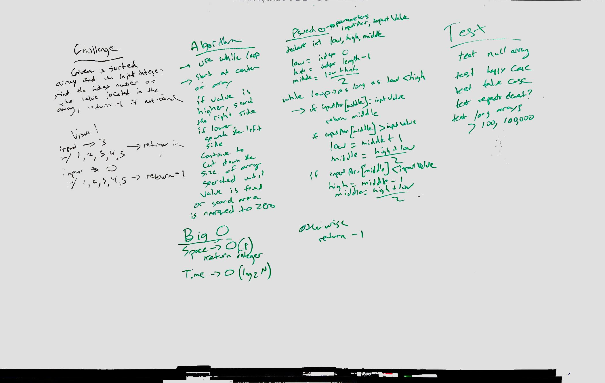

# Array Binary Search

    Binary search in a sorted 1D array

## Challenge

    Write a function called BinarySearch which takes in 2 parameters: a sorted array and the search key.
    Without utilizing any of the built-in methods available to your language, return the index of the
    array’s element that is equal to the search key, or -1 if the element does not exist.

    Example:

    [4,8,15,16,23,42], 15   ->	2

    [11,22,33,44,55,66,77], 90  ->  -1

## Approach & Efficiency

    Solved using while loop. Start in center.

    Big O:
      Space -> O(1)
      Time -> O(log2 N)

## Solution

## Notes