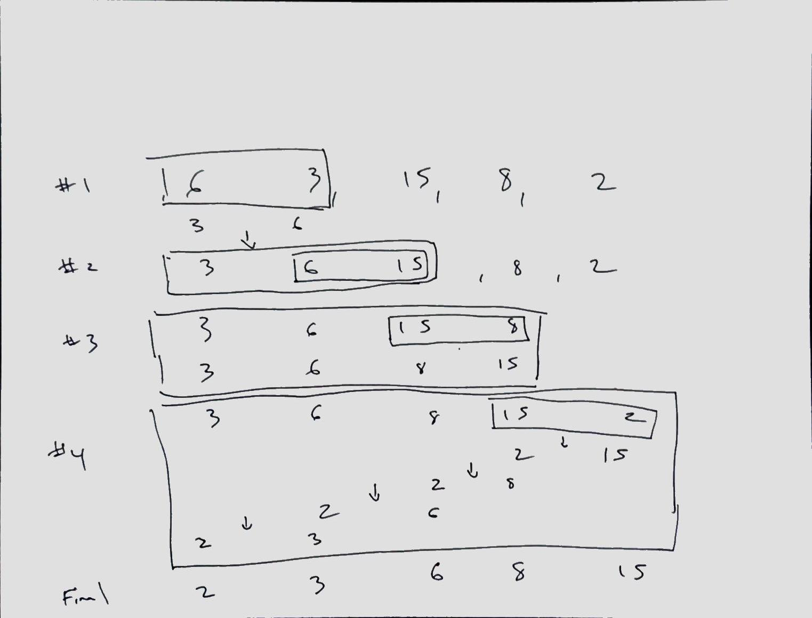

# Insertion Sort Lecture

## Learning Objectives

How to implement an insertion sort.

## Lecture Flow

- Ask students how was their day, questions, concerns.
- Discuss sorting in general
- Introduce Insertion Sort
- Show video of insertion sort in action
- Discuss algorithm
- Code demo
- Any Questions?

## Diagram

## Algorithm

        Iterate through array starting from index 1
        
        Store this index value in a temp value
        
        Using a while loop within the for loop, check to see if the previous index
        is less than or equal to the current index
        
        if yes, exit while loop and continue the for loop iteration
        if not, swap the values and iterate backwards the previous values
        
        continue this until all values have been compared
        
        set the temp value to equal last index visited in the while loop
        
## Psuedo

    InsertionSort(int[] arr)
      
        FOR i = 1 to arr.length
        
          int j <-- i - 1
          int temp <-- arr[i]
          
          WHILE j >= 0 AND temp < arr[j]
            arr[j + 1] <-- arr[j]
            j <-- j - 1
            
          arr[j + 1] <-- temp

## Readings and References

### Watch

- [Video](https://www.youtube.com/watch?v=ROalU379l3U)

### Read

- [Reading #1](https://www.geeksforgeeks.org/insertion-sort/)
- [Reading #2](https://www.hackerearth.com/practice/algorithms/sorting/insertion-sort/tutorial/)

### Bookmark

- [Website](https://www.khanacademy.org/computing/computer-science/algorithms)

