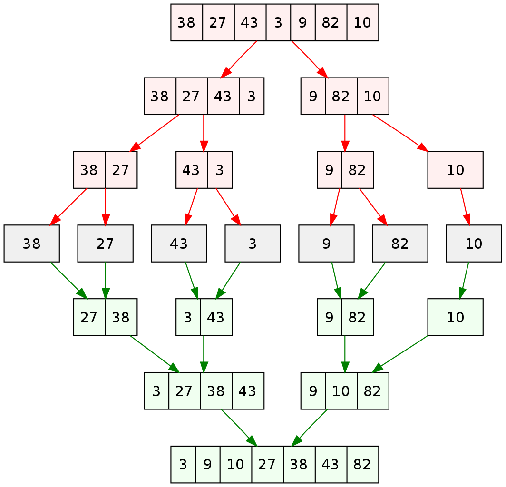

# Merge Sort Lecture

## Learning Objectives

How to implement a merge sort.

## Lecture Flow

- Ask students how was their day, questions, concerns.
- Discuss sorting in general
- Introduce Merge Sort
- Show video of merge sort in action
- Discuss algorithm
- Code demo
- Any Questions?

## Diagram

[Source](https://upload.wikimedia.org/wikipedia/commons/thumb/e/e6/Merge_sort_algorithm_diagram.svg/1064px-Merge_sort_algorithm_diagram.svg.png)

## Algorithm

    Two methods:
        First method recursively divides the array into halves until each array length is <2.
        Then calls on second method to merge the arrays together while sorting the values.
        
        Second method copies values from the two split arrays into a "result" array while there are still values from both arrays.
        
        Three cases:
            1st Case - if both input arrays have values to be copied, the values will be compared to each other
            and the lowest value of the two will be entered into the result array in an iteration
            
            2nd/3rd case - if either array runs out of values to be copied, the result array will assume values from the other array
            until there is nothing left
            
        There result array is returned and will be continuously combined due to the recursion until a final sort array is returned.
        
        
        
## Pseudo

            ALGORITHM Mergesort(arr)
            DECLARE n <-- arr.length
                   
            if arr.length > 1
              DECLARE mid <-- n/2
              DECLARE b <-- arr[0...mid]
              DECLARE c <-- arr[mid...n]
              // break down the left side
              Mergesort(b)
              // break down the right side
              Mergesort(c)
              // merge the left and the right side together
              Merge(b, c, arr)
        
        ALGORITHM Merge(b, c, a)
            DECLARE i <-- 0
            DECLARE j <-- 0
            DECLARE k <-- 0
        
            while i < b && j < c
                if b[i] <= c[j]
                    a[k] <-- b[i]
                    i <-- i + 1
                else
                    a[k] = c[j]
                    j <-- j + 1
                    
                k <-- k + 1
        
            if i = b.length
               add remaining items in array c to array a
            else
               add remaining items in array b to array a
               
            return a

## Readings and References

### Watch

- [Video](https://www.youtube.com/watch?v=XaqR3G_NVoo)

### Read

- [Reading #1](https://www.geeksforgeeks.org/merge-sort/)
- [Reading #2](https://en.wikipedia.org/wiki/Merge_sort)

### Bookmark

- [Website](https://www.khanacademy.org/computing/computer-science/algorithms)

