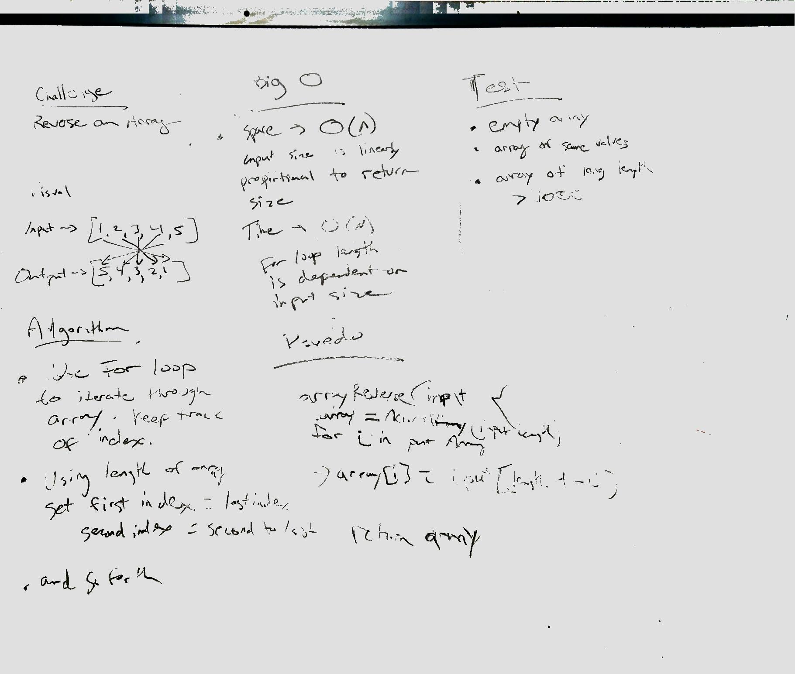

# Array Reverse

    Reverse the index order of an array.

## Challenge

    Write a function called reverseArray which takes an array as an argument. Without utilizing any of the built-in methods available to your language, return an array with elements in reversed order.

    Example:

    [1, 2, 3, 4, 5, 6] ->	[6, 5, 4, 3, 2, 1]
    [89, 2354, 3546, 23, 10, -923, 823, -12] ->	[-12, 823, -923, 10, 23, 3546, 2354, 89]

## Approach & Efficiency

    Solved using for loop. Best Space/Time efficiency with arrays.

    Big O:
      Space -> O(N)
      Time -> O(N)

## Solution

## Notes